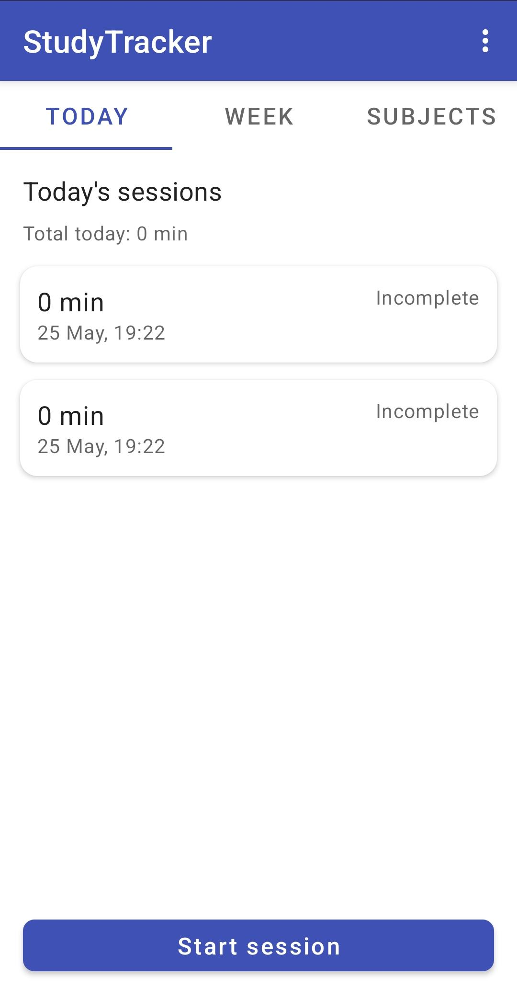
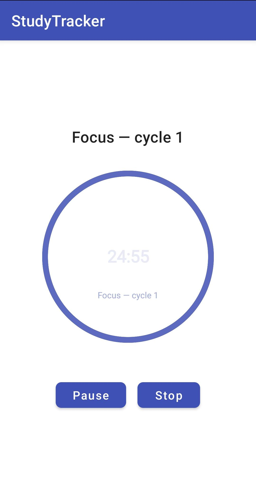
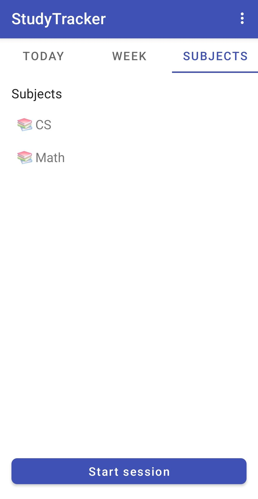
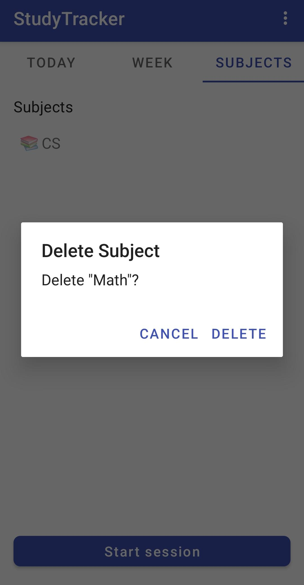
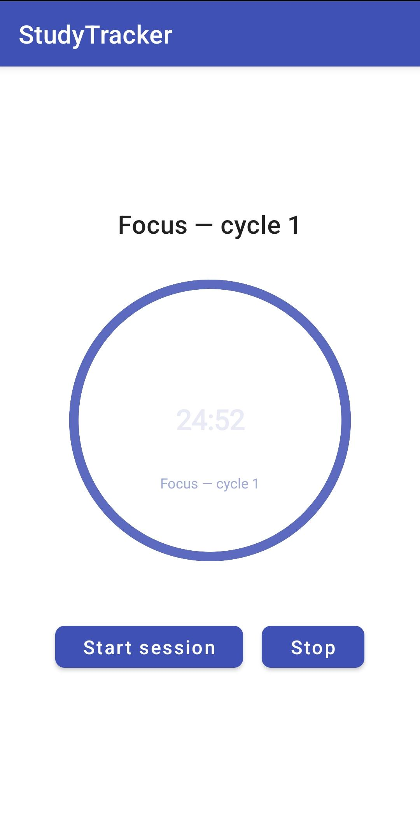
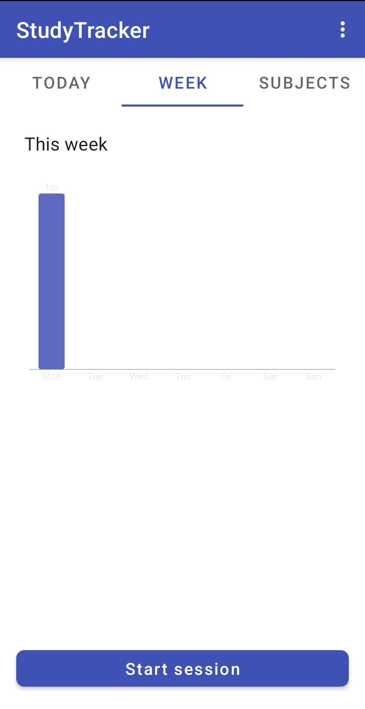
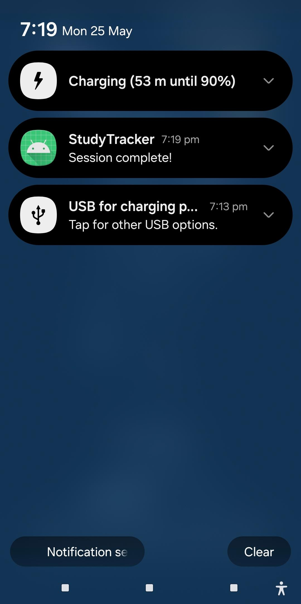
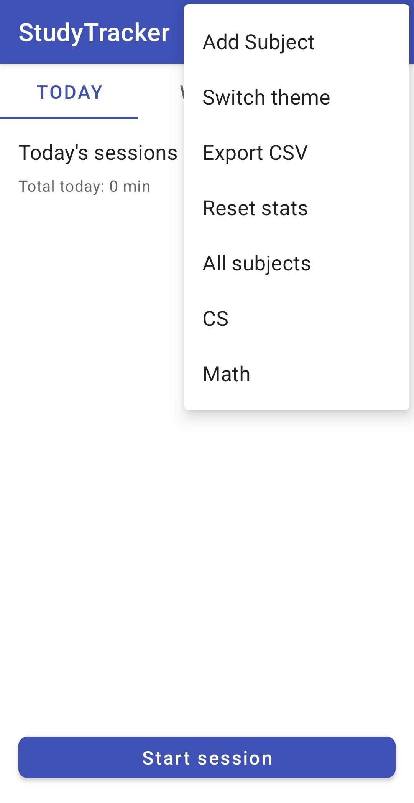

# 📚 StudyTracker

A modern Android study productivity app built using Java, Android SDK, Room Database, LiveData, and Foreground Services. StudyTracker helps students manage focused study sessions using the Pomodoro technique while tracking statistics, streaks, and subject-based study history.


## ✨ Features

### ⏳ Pomodoro Study Timer
- Foreground countdown timer service with pause/resume/stop controls
- Persistent notification support
- Automatic vibration on session completion
- Prevents timer loss during app backgrounding

### 📊 Statistics & Analytics
- Daily and weekly study tracking
- Study streak calculation and weekly breakdown analytics
- Custom animated bar charts and circular progress views

### 📚 Subject Management
- Add and manage study subjects with duplicate prevention
- Swipe-to-delete with confirmation dialog
- Subject-based filtering for sessions

### 🧩 Modern Android Architecture
- Room Database with DAO pattern
- ViewModel + LiveData for reactive UI
- Fragment-based dashboard
- Foreground Service communication
- Custom Views with `onDraw()`

### ⚙️ Additional Features
- CSV export for study sessions
- Light/Dark theme with persistent preference
- Landscape + portrait orientation support
- Android 14 foreground service compatibility

---

## 👥 Team Members

| Member | Contributions |
|--------|----------------|
| **Muhammad Saad Javed (msj)** | Project setup, architecture, Activities, navigation, themes, BaseActivity, PomodoroManager (state machine), subject dialog, SessionDetailActivity, Git management, bug fixes, APK build |
| **Benjamin Gerard (bg)** | Room database, DAOs, ViewModel, LiveData, Fragments (Today/Week/Subjects), RecyclerView adapter, unit tests for data layer |
| **Hassan Raza (hr)** | TimerService (foreground service), ScreenReceiver, SessionActivity integration, vibrator on session complete, unit tests for timer logic |
| **Lok Pradeep Tonny Ruthira Kumar (lptrk)** | BarChartView, TimerProgressView, StatsCalculator, CSV export, SettingsActivity, unit tests for stats |

---

## 🛠️ Tech Stack

| Technology | Version | Purpose |
|------------|---------|---------|
| Java | — | Primary language |
| Room | 2.6.1 | Local database |
| Lifecycle (ViewModel + LiveData) | 2.7.0 | Architecture components |
| Material Components | 1.11.0 | UI components |
| Fragment | 1.6.2 | Navigation |
| AndroidX AppCompat | 1.6.1 | Backward compatibility |
| ConstraintLayout | 2.1.4 | Responsive layouts |

**Architecture:** MVVM

---

## 🏗️ Project Architecture

```
UI Layer
├── Activities
├── Fragments
├── RecyclerViews
└── Custom Views

Data Layer
├── Room Database
├── DAOs
├── Entities
└── ViewModel + LiveData

Service Layer
├── TimerService
├── PomodoroManager
└── ScreenReceiver
```

---

## 📁 Project Structure

```
android-project-dandroids/
│
├── app/src/
│ ├── main/java/com/dandroids/studytracker/
│ │ ├── activities/ → Dashboard, Session, SessionDetail, Settings, BaseActivity
│ │ ├── adapter/ → SessionAdapter (RecyclerView)
│ │ ├── db/ → AppDatabase, SessionDao, SubjectDao
│ │ ├── fragments/ → TodayFragment, WeekFragment, SubjectsFragment
│ │ ├── manager/ → PomodoroManager
│ │ ├── model/ → Session, Subject (Room entities)
│ │ ├── receiver/ → ScreenReceiver
│ │ ├── service/ → TimerService (Foreground Service)
│ │ ├── utils/ → CsvExporter, StatsCalculator
│ │ ├── viewmodel/ → StudyViewModel
│ │ └── views/ → BarChartView, TimerProgressView
│ └── res/
│ ├── layout/ → Activity and Fragment layouts
│ ├── layout-land/ → Landscape layouts
│ ├── menu/ → Options menu
│ ├── values/ → Colors, themes, strings, styles
│ ├── values-night/ → Dark theme colors
│ └── xml/ → FileProvider paths
│
├── screenshots/                            ← NEW - app screenshots
│   ├── dashboard.png
│   ├── timer.png
│   ├── subject_delete.png
│   ├── pause.png
│   ├── weekly_stats.png
│   ├── notification.png
│   └── menu.png
│
├── docs/
│   └── technical_documentation.pdf
│
├── gradle/
├── .gitignore
├── build.gradle.kts
├── settings.gradle.kts
├── gradle.properties
├── gradlew
├── gradlew.bat
├── local.properties
│
├── app-debug.apk
├── app-release.apk
└── README.md
```

---

## 📱 Main Screens

| Screen | Description |
|--------|-------------|
| **DashboardActivity** | Main entry point — tab navigation, subject management, theme toggle, export/reset |
| **SessionActivity** | Active study session — timer controls, foreground service binding, circular progress animation |
| **SessionDetailActivity** | Detailed information about completed sessions |
| **SettingsActivity** | CSV export, statistics reset, theme preferences |

---

## 🧱 Core Components

### Room Database
- `AppDatabase`, `SessionDao`, `SubjectDao`
- Entities: `Session`, `Subject`

### ViewModel & LiveData
`StudyViewModel` provides reactive updates between database and UI components. Used in TodayFragment, WeekFragment, SubjectsFragment, and SessionDetailActivity.

### Foreground Timer Service
`TimerService` runs countdown independently from UI lifecycle, maintains persistent notification, supports pause/resume/stop, handles screen on/off events.

### PomodoroManager
Implements Pomodoro cycle logic: Focus sessions → Short breaks → Long breaks with SharedPreferences persistence.

### Custom Views
- **BarChartView** — Custom `onDraw()` for study analytics visualization
- **TimerProgressView** — Animated circular progress timer with dynamic color transitions

---

## 🧪 Testing

Unit tests implemented for:
- Timer logic
- Pomodoro cycle logic
- Stats calculations
- Data layer/model logic

---

## 🚀 Setup Instructions

### Prerequisites
- Android Studio (latest version)
- Android SDK API 24+
- Java 8+

### Steps

1. **Clone the repository**
   ```bash
   git clone https://github.com/arcreane/android-project-dandroids.git
   cd android-project-dandroids
   ```

2. **Open in Android Studio** → File → Open → Select the cloned folder

3. **Sync Gradle** → File → Sync Project with Gradle Files

4. **Build the project** → Build → Make Project (Ctrl+F9)

5. **Run the app** → Connect Android device (USB debugging enabled) or start emulator → Click Run (▶)

---

## 📸 Screenshots

| Feature | Screenshot |
|---------|------------|
| Dashboard |  |
| Timer |  |
| Subjects |  |
| Subject Delete |  |
| Pause/Resume |  |
| Weekly Statistics |  |
| Notification |  |
| Options Menu |  |


## 📂 Git Workflow

The project used feature branches with pull requests to `dev`, then final merge to `main`:
```
main (final submission)
↑
dev (integration branch)
↑
├── feature/msj-ui-shell
├── feature/bg-data-layer
├── feature/hr-timer-service
└── feature/lptrk-stats-export
```
### Commit Convention Examples
```
feat(hr): implement TimerService as foreground service
fix(msj): fix timer blinking and persistent notification
feat(bg): add StudyViewModel with LiveData
feat(lptrk): add StatsCalculator with streak logic
```

---

## 🚀 Future Improvements

- Cloud synchronization
- User accounts
- Notifications scheduling
- Advanced analytics
- Backup & restore
- Widget support
- Focus music integration 🎧

---

## 🎓 Course Information

| Field | Details |
|-------|---------|
| **School** | EPITA |
| **Course** | Introduction to Native Mobile Applications — Android (Java) |
| **Professor** | Dominique Yolin |

---

## 🔗 Links

**GitHub Repository:** [https://github.com/arcreane/android-project-dandroids](https://github.com/arcreane/android-project-dandroids)

---

*Made by Dandroids*
